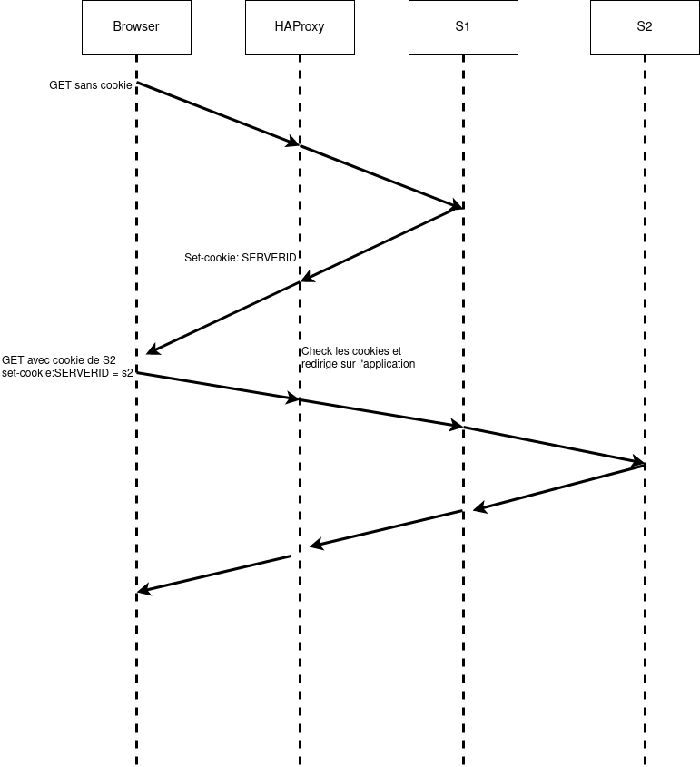

# AIT - Laboratoire N°3
## Load Balancing

```
Auteurs:
Sacha Perdrizat
Alban Favre
Moïn Danai
```

### Introduction

Dans ce laboratoire nous allons explorer les fonctionnalitées du ``Load Balancer`` HAproxy. Ce rapport découpe les livrables dans les plusieurs tâches.

### Tâche 1(tout le monde)

1. Explain how the load balancer behaves when you open and refresh the
    URL <http://192.168.42.42> in your browser. Add screenshots to
    complement your explanations. We expect that you take a deeper a
    look at session management.

2. Explain what should be the correct behavior of the load balancer for
    session management.

3. Provide a sequence diagram to explain what is happening when one
    requests the URL for the first time and then refreshes the page. We
    want to see what is happening with the cookie. We want to see the
    sequence of messages exchanged (1) between the browser and HAProxy
    and (2) between HAProxy and the nodes S1 and S2. Here is an example:


4. Provide a screenshot of the summary report from JMeter.

5. Run the following command:

  ```bash
  $ docker stop s1
  ```

  Clear the results in JMeter and re-run the test plan. Explain what
  is happening when only one node remains active. Provide another
  sequence diagram using the same model as the previous one.


### Tâche 2(Sacha)

1. There is different way to implement the sticky session. One possibility is to use the SERVERID provided by HAProxy. Another way is to use the NODESESSID provided by the application. Briefly explain the difference between both approaches (provide a sequence diagram with cookies to show the difference).

  * Choose one of the both stickiness approach for the next tasks.

  

**Il est recommandé d'utilisé le cookie SERVERID, comme il sont délivré par le load balancer il seront plus fiable.**

2. Provide the modified `haproxy.cfg` file with a short explanation of the modifications you did to enable sticky session management.

**Pour utiliser le NODESESSID ou le SERVERID qui nous est donnée par l'application il convient d'ajouter ceci à la configuration**

```
backend node

  cookie {NODESESSID | SERVERID} insert indirect nocache
  server s1 ${WEBAPP_1_IP}:3000 check cookie s1
  server s2 ${WEBAPP_2_IP}:3000 check cookie s2

```

**Le tout en redémarrant le load balancer**

3. Explain what is the behavior when you open and refresh the URL <http://192.168.42.42> in your browser. Add screenshots to complement your explanations. We expect that you take a deeper a look at session management.

4. Provide a sequence diagram to explain what is happening when one requests the URL for the first time and then refreshes the page. We want to see what is happening with the cookie. We want to see the sequence of messages exchanged (1) between the browser and HAProxy and (2) between HAProxy and the nodes S1 and S2. We also want to see what is happening when a second browser is used.

5. Provide a screenshot of JMeter\'s summary report. Is there a difference with this run and the run of Task 1?

  * Clear the results in JMeter.

  * Now, update the JMeter script. Go in the HTTP Cookie Manager and <del>uncheck</del><ins>verify that</ins> the box `Clear cookies each iteration?` <ins>is unchecked</ins>.

  * Go in `Thread Group` and update the `Number of threads`. Set the value to 2.

7. Provide a screenshot of JMeter\'s summary report. Give a short explanation of what the load balancer is doing.

### Tâche 3(Moïn)

1. Take a screenshot of the Step 5 and tell us which node is answering.

2. Based on your previous answer, set the node in DRAIN mode. Take a screenshot of the HAProxy state page.

3. Refresh your browser and explain what is happening. Tell us if you stay on the same node or not. If yes, why? If no, why?

4. Open another browser and open `http://192.168.42.42`. What is happening?

5. Clear the cookies on the new browser and repeat these two steps multiple times. What is happening? Are you reaching the node in DRAIN mode?

6. Reset the node in READY mode. Repeat the three previous steps and explain what is happening. Provide a screenshot of HAProxy\'s stats page.

7. Finally, set the node in MAINT mode. Redo the three same steps and explain what is happening. Provide a screenshot of HAProxy\'s stats page.


### Tâche 4(Alban)

*Remark*: Make sure you have the cookies are kept between two requests.

1. Be sure the delay is of 0 milliseconds is set on `s1`. Do a run to have base data to compare with the next experiments.

2. Set a delay of 250 milliseconds on `s1`. Relaunch a run with the JMeter script and explain what it is happening?

3. Set a delay of 2500 milliseconds on `s1`. Same than previous step.

4. In the two previous steps, are there any error? Why?

5. Update the HAProxy configuration to add a weight to your nodes. For that, add `weight [1-256]` where the value of weight is between the two values (inclusive). Set `s1` to 2 and `s2` to 1. Redo a run with 250ms delay.

6. Now, what happened when the cookies are cleared between each requests and the delay is set to 250ms ? We expect just one or two sentence to summarize your observations of the behavior with/without cookies.

### Tâche 5(tout le monde)

**Deliverables:**

1. Briefly explain the strategies you have chosen and why you have chosen them.

2. Provide evidences that you have played with the two strategies (configuration done, screenshots, ...)

3. Compare the both strategies and conclude which is the best for this lab (not necessary the best at all).


### Conclusion

## Annexes
