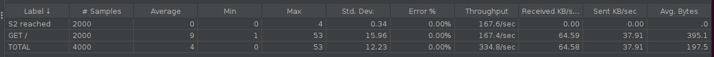
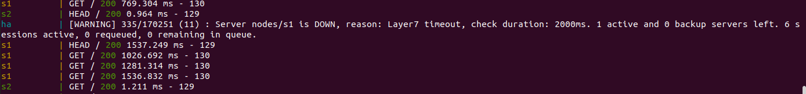

# AIT - Laboratoire N°3
## Load Balancing

```
Auteurs:
Sacha Perdrizat
Alban Favre
Moïn Danai
```

### Introduction

Dans ce laboratoire nous allons explorer les fonctionnalitées du ``Load Balancer`` HAproxy. Ce rapport découpe les livrables dans les plusieurs tâches.

### Tâche 1

1. Explain how the load balancer behaves when you open and refresh the URL <http://192.168.42.42> in your browser. Add screenshots to complement your explanations. We expect that you take a deeper a look at session management.

  **Réponse:**

  **HAProxy fonctionne avec des *frontends* et *backends*.**

2. Explain what should be the correct behavior of the load balancer for
    session management.

    **Réponse:**

    **Pour une bonne gestion des sessions l'on s'attend à ce le load Balancer route les requêtes aux serveur en fonction d'un cookie de sessions**

3. Provide a sequence diagram to explain what is happening when one requests the URL for the first time and then refreshes the page. We want to see what is happening with the cookie. We want to see the sequence of messages exchanged (1) between the browser and HAProxy and (2) between HAProxy and the nodes S1 and S2.

    **Réponse**

    **On the flowchart below, we can see how HAProxy injects two headers that pertain to the proper identification of client requests being proxied. As the backend mode is round-robin, every request is sent to S1 while every other request is sent to S2.**

    

4. Provide a screenshot of the summary report from JMeter.


5. Run the following command:

  ```bash
  $ docker stop s1
  ```

 Clear the results in JMeter and re-run the test plan. Explain what is happening when only one node remains active. Provide another sequence diagram using the same model as the previous one.


**We can see HAProxy spitting some warnings:**

```
ha         | [WARNING] 329/152730 (10) : Server nodes/s1 is DOWN, reason: Layer4 timeout, check duration: 2002ms. 1 active and 0 backup servers left. 0 sessions active, 0 requeued, 0 remaining in queue.
```

**Indeed, HAProxy timed out trying to reach `/` on s1 so it skipped marked it DOWN and skipped it for future requests.**


### Tâche 2

1. There is different way to implement the sticky session. One possibility is to use the SERVERID provided by HAProxy. Another way is to use the NODESESSID provided by the application. Briefly explain the difference between both approaches (provide a sequence diagram with cookies to show the difference).

  * Choose one of the both stickiness approach for the next tasks.

  **Avec le SERVERID**
  

  **Avec le NODESESSID**
  

**Il est recommandé d'utilisé le cookie SERVERID, comme il sont délivré par le load balancer il seront plus fiable. Il n'est pas garantit que les cookies délivré par les applications soit distinct**

2. Provide the modified `haproxy.cfg` file with a short explanation of the modifications you did to enable sticky session management.

**Pour utiliser le NODESESSID ou le SERVERID qui nous est donnée par l'application il convient d'ajouter ceci à la configuration**


```
backend node

  cookie {NODESESSID | SERVERID} insert indirect nocache
  server s1 ${WEBAPP_1_IP}:3000 check cookie s1
  server s2 ${WEBAPP_2_IP}:3000 check cookie s2

```

**Le tout en redémarrant le load balancer**

**NB: Nous utiliserons le SERVERID pour la suite des exemples**

3. Explain what is the behavior when you open and refresh the URL <http://192.168.42.42> in your browser. Add screenshots to complement your explanations. We expect that you take a deeper a look at session management.

**Lorsque nous faisons une requête et plusieurs ``refresh`` nous observons que le load Balancer nous renvoie sur le même serveur.**

**Aperçu d'une capture sur Wireshark**

```
Hypertext Transfer Protocol
    HTTP/1.1 200 OK\r\n
    x-powered-by: Express\r\n
    x-backend-ip: 192.168.42.11\r\n
    content-type: application/json; charset=utf-8\r\n
    content-length: 129\r\n
        [Content length: 129]
    etag: W/"81-VrGks1g0NUpZwi+ckNKdYx7w5t0"\r\n
    # Préparation du NODESESSID ######
    set-cookie: NODESESSID=s%3Ad83uu7wWdkEIyVFM0rx_wqNuyXvmoB8R.myRuFLo3DjR2ZBQC9GEL3GAVIvd4kKFce2TS7zGNIw0; Path=/; HttpOnly\r\n
    ##################################
    vary: Accept-Encoding\r\n
    date: Wed, 25 Nov 2020 15:18:29 GMT\r\n
    keep-alive: timeout=5\r\n
    # Préparation du SERVERID #########
    set-cookie: SERVERID=s1; path=/\r\n
    ###################################
    cache-control: private\r\n
    \r\n
    [HTTP response 1/1]
    [Time since request: 0.005106200 seconds]
    [Request in frame: 39]
    [Request URI: http://192.168.42.42/]
    File Data: 129 bytes
```

4. Provide a sequence diagram to explain what is happening when one requests the URL for the first time and then refreshes the page. We want to see what is happening with the cookie. We want to see the sequence of messages exchanged (1) between the browser and HAProxy and (2) between HAProxy and the nodes S1 and S2. We also want to see what is happening when a second browser is used.


5. Provide a screenshot of JMeter\'s summary report. Is there a difference with this run and the run of Task 1?

**En observant la capture des requêtes sur Jmeter On remarque que toutes les requêtes ont été délivré sur le même serveur**


  * Clear the results in JMeter.

  * Now, update the JMeter script. Go in the HTTP Cookie Manager and <del>uncheck</del><ins>verify that</ins> the box `Clear cookies each iteration?` <ins>is unchecked</ins>.

  * Go in `Thread Group` and update the `Number of threads`. Set the value to 2.

7. Provide a screenshot of JMeter\'s summary report. Give a short explanation of what the load balancer is doing.

**Le test JMeter ci-dessous va effectuer les requêtes sur 2 threads(users), on va donc observer que pour chaque utilisateur les session vont se répartir entre les serveur, 1000 sur s1 et 1000 sur s2**


### Tâche 3

1. Take a screenshot of the Step 5 and tell us which node is answering.
  **In the screen we can see that onyl s2 is answering**
  

2. Based on your previous answer, set the node in DRAIN mode. Take a screenshot of the HAProxy state page.

**Answer**


3. Refresh your browser and explain what is happening. Tell us if you stay on the same node or not. If yes, why? If no, why?

**Answer**

No, we are now getting replies from s1 only since s2 is being drain of requests and slowly set aside (i.e. not getting requests anymore, out of commission).

4. Open another browser and open `http://192.168.42.42`. What is happening?

**Answer**

We get the following:

```
{
  "hello":"world!",
  "ip":"192.168.42.11",
  "host":"0a228300f282",
  "tag":"s1",
  "sessionViews":11,
  "id":"1t-Yg2rLj4TQWpQyXFRTudDq4NFtbrBx"
}
```

upon each page refresh, except the `id` which changes each time.

5. Clear the cookies on the new browser and repeat these two steps multiple times. What is happening? Are you reaching the node in DRAIN mode?

**Answer**

Still not, no. We always get a similar response (variable `id`).

6. Reset the node in READY mode. Repeat the three previous steps and explain what is happening. Provide a screenshot of HAProxy\'s stats page.

**Answer**

We now get responses from both nodes in a round-robin fashion, as before.


7. Finally, set the node in MAINT mode. Redo the three same steps and explain what is happening. Provide a screenshot of HAProxy\'s stats page.

**Answer**


As for step 4, we only get responses from s1 with variable `id`.

### Tâche 4

*Remark*: Make sure you have the cookies are kept between two requests.

1. Be sure the delay is of 0 milliseconds is set on `s1`. Do a run to have base data to compare with the next experiments.

**Note: j'utilise 2 threads et 1000 loops et j'ai set le delay de S2 a 0**


2. Set a delay of 250 milliseconds on `s1`. Relaunch a run with the JMeter script and explain what it is happening?

**Ça prend beaucoup plus de temps a faire le test, du aux 2 users et qu'il faut attendre 250 ms sur S1, on peut le voir dans la colonne Throughput: S2 a une valeur très proche de celle de la base, alors que S1 atteint juste 3.3 par seconde.**


3. Set a delay of 2500 milliseconds on `s1`. Same than previous step.

**On peut voir que le S1 n'est même pas affiché, car jamais atteint.**



4. In the two previous steps, are there any error? Why?

**dans les logs docker compose on peut voir ce message dans la ligne ha: "... Server nodes/s1 is DOWN ... Layer7 timeout ...", cela est du au fait que le délais de 2500 millisecondes est plus grand que le délais de timeout, du coup au yeux du proxy, le serveur s1 est down**


5. Update the HAProxy configuration to add a weight to your nodes. For that, add `weight [1-256]` where the value of weight is between the two values (inclusive). Set `s1` to 2 and `s2` to 1. Redo a run with 250ms delay.

**10 utilisateurs avec 100 loops pour gagner du temps (et avoir des chiffres qui se lisent facilement en pour mille), d'abord sans les 250 ms de delay sur S1, On peut voir que dans la répartition est différente: au lieu de la répartitions 50/50 comme dans la partie 4.2 (1000-1000) on a soit : 300-700 ou 600-400 (avoir exactement 333-666 est impossible avec 10 utilisateurs (10 mod 3 n'est pas 0))**


**Avec le delay de 250 ms sur S1, l’exemple du dessous est la seule fois ou il a survécu. (je n'ai jamais pu voir l'autre resultat (300-700)).**


**Avec 250 ms de delay un poids de 2 sur S1 et 10, il a tendance a faire un timeout ce qui donne le résultat suivant. La conséquence est que tout est redirigé sur S2 ce qui donne des résultats qui ne s'approche pas du tout des poids 1 pour 2 (33-66) (logique comme S1 est considéré down)**




6. Now, what happened when the cookies are cleared between each requests and the delay is set to 250ms ? We expect just one or two sentence to summarize your observations of the behavior with/without cookies.

**Malheureusement je ne peux pas faire cette partie avec 10 users comme j'ai systématiquement un timeout, même si au lieu de 100 itérations j'en fait seulement 10.**


**par contre avec 2 utilisateurs et 500 loops (pour avoir des pour mille) j'obtiens ça (333-667) (au lieu de 500-500) cela est du au fait que comme les cookies sont effacé à chaque tentative c'est comme si nos 2 users sont en fait 1000 users comme le cookie est leur mémoire et du coup oublie a chaque fois quel serveur leur avait été assigné **


### Tâche 5

In this part of the lab, you will be less guided and you will have more opportunity to play and discover HAProxy. The main goal of this part is to play with various strategies and compare them together.

We propose that you take the time to discover the different strategies in HAProxy documentation and then pick two of them (can be round-robin but will be better to chose two others). Once you have chosen your strategies, you have to play with them (change configuration, use Jmeter script, do some experiments).

**Deliverables:**

1. Briefly explain the strategies you have chosen and why you have chosen them.

**Nous avons choisi les algorithm suivant pour afin de tester le Load-Balancer, cela nous permettra de comparer ces différentes stratégie avec Round-Robin**

**Stratégie choisi**
- Source : Car il s'agit d'un stratégie statique sans cookie
- Leastconn : Car il s'agit d'un stratégie statique

2. Provide evidences that you have played with the two strategies (configuration done, screenshots, ...)

##### Stratégie Source

  La stratégie (statique) de load balancing *Source* utilise l'address ip source et le poids des serveurs cible pour déterminer vers quels application un client devra être renvoyée.

  **Configuration de HAProxy**

  On configure la stratégie d'ordonnancement dans ``backend`` et on définie le nombres de connexions maximal.

  ```
  balance source

  server s1 ${WEBAPP_1_IP}:3000
  server s2 ${WEBAPP_2_IP}:3000
  ```

  **Démonstration du fonctionnement avec Jmeter**

  **Capture avec les poids de base**
  

  **Capture avec s2 prioritaire**

  Modifions le serveur s2 avec un poids plus important

  ```
  server s2 ${WEBAPP_2_IP}:3000 weight 30
  ```
  

##### Stratégie leastconn

  La stratégie d'ordonnancement *lestconn* prend comme paramètre le nombre de connections établis avec les serveur et va diriger les requêtes vers le serveur le moins chargé.

  **Configuration de HAProxy**

  On configure la stratégie d'ordonnancement dans ``backend``.meme

  ```
  balance leastconn
  ```

  **Démonstration du fonctionnement avec Jmeter**
  Pour tester la configuration nous allons introduire un délai de traitement entre les deux serveur ce qui forcera la stratégie à diriger les requêtes vers le serveurs avec le moins de délai (qui aura le moins de connexion en cours).

```bash
curl -H "Content-Type: application/json" -X POST -d '{"delay": 300}' http://192.168.42.11:3000/delay

curl -H "Content-Type: application/json" -X POST -d '{"delay": 30}' http://192.168.42.22:3000/delay
```

On observe ainsi que lors du test de charge on se retrouve avec le serveur s2 priorisé, car il possède un meilleur *throughput*.


  3. Compare the both strategies and conclude which is the best for this lab (not necessary the best at all).

Pour notre laboratoire il se trouve que chacune des stratégies n'est pas parfaitement adapté à notre situation, *Source* étant adapté pour des session sans cookie et *leastconn* n'est pas recommandé pour les session courtes comme HTTP, cependant comme il nous faut choisir nous allons préférer *leastconn* car il s'agit d'un algorithme dynamique (qui peut adapter les poids des nœuds)

### Conclusion

Dans ce laboratoire nous avons pu découvrir et expérimenter le fonctionnement du LoadBalancer HAproxy, nous avons pu observer comment les session sont gérée au travers des cookies, et comment est répartie la charge utile en fonction des stratégie d’ordonnancement.
